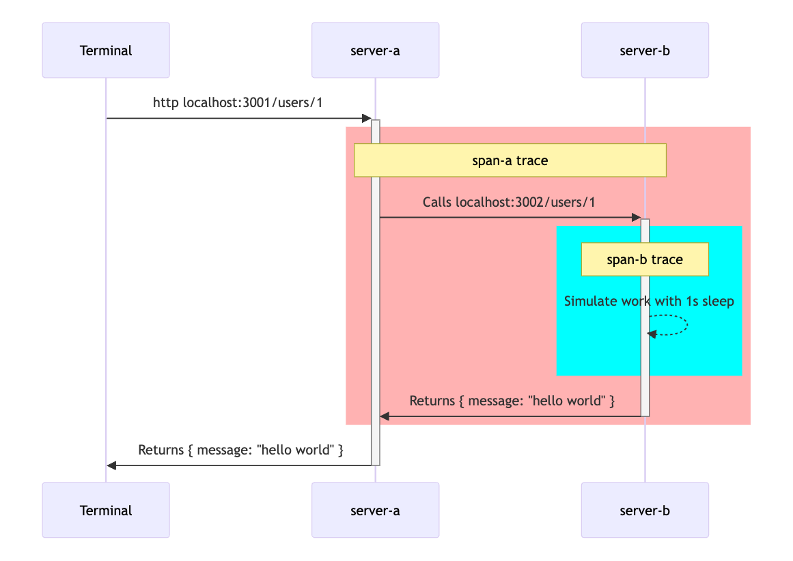
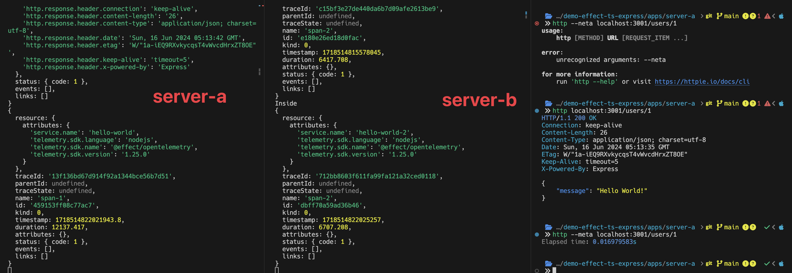

# Effect TS Express + Console Telemetry

Simple project exploring telemetry capabilities with EffectTS.

`apps/server-a` and `apps/server-b` are in use. The rest is default configuration that I've imported from `packages` after scaffolding from the default create Turborepo command `pnpm dlx create-turbo@latest demo-effect-ts-express`.

## Getting started

```s
# Install deps
$ pnpm install
# Start dev servers with Turborepo
$ pnpm dev
```

> **Please note**: Unsure (but fairly certain) if running Turborepo + Nodemon will cook your RAM as it did mine. Haven't looked too deep into the configuration yet. Might be better to jump into `apps/server-a` and `apps/server-b` in separate terminals to run `pnpm dev` from there.

## Overview



There is an issue with the duration looking way to long. This may relate to how I've currently configured the application.


